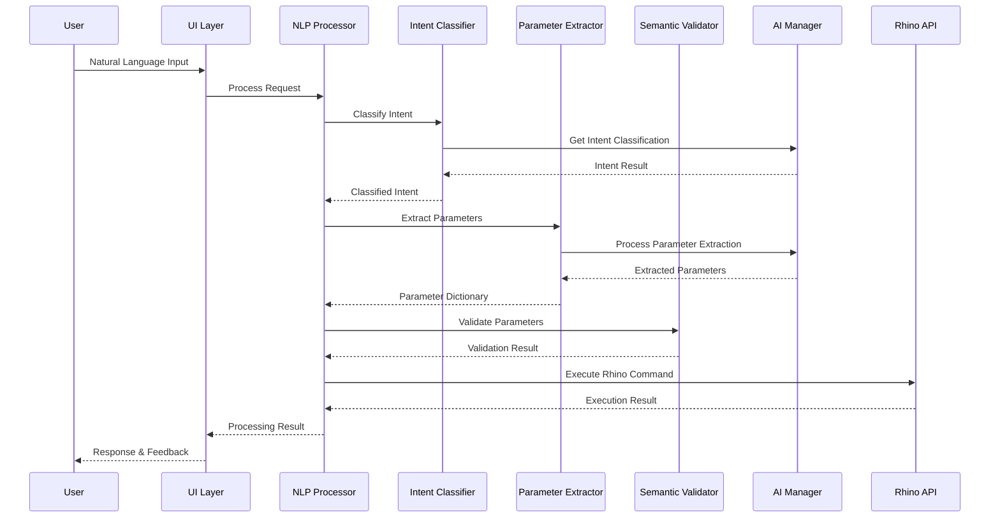
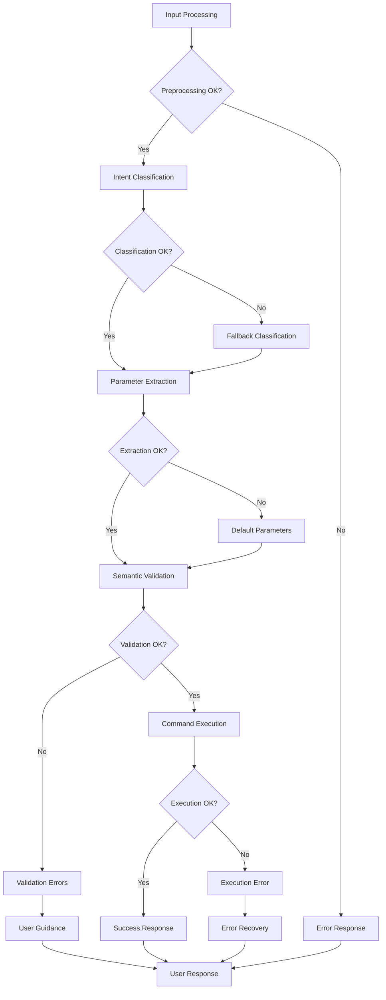

# RhinoAI Plugin - Architecture Overview

## Introduction

The RhinoAI plugin represents a sophisticated integration of artificial intelligence technologies with Rhino 3D CAD software. This document provides a comprehensive overview of the system architecture, design patterns, and technical implementation details.

## System Architecture

### High-Level Architecture

The RhinoAI plugin follows a modular, layered architecture designed for scalability, maintainability, and extensibility. The system is built on five primary layers:

```
┌─────────────────────────────────────────────────────────────┐
│                    User Interface Layer                     │
│  ┌─────────────┐  ┌─────────────┐  ┌─────────────────────┐ │
│  │ AI Control  │  │ Command     │  │ Settings & Config   │ │
│  │ Panel       │  │ Interface   │  │ Dialogs             │ │
│  └─────────────┘  └─────────────┘  └─────────────────────┘ │
└─────────────────────────────────────────────────────────────┘
                              │
┌─────────────────────────────────────────────────────────────┐
│                 AI Processing Layer                         │
│  ┌─────────────┐  ┌─────────────┐  ┌─────────────────────┐ │
│  │ Enhanced    │  │ Intent      │  │ Context Manager &   │ │
│  │ NLP Engine  │  │ Classifier  │  │ Parameter Extractor │ │
│  └─────────────┘  └─────────────┘  └─────────────────────┘ │
└─────────────────────────────────────────────────────────────┘
                              │
┌─────────────────────────────────────────────────────────────┐
│                AI Integration Layer                         │
│  ┌─────────────┐  ┌─────────────┐  ┌─────────────────────┐ │
│  │ OpenAI      │  │ Anthropic   │  │ MCP Protocol &      │ │
│  │ Client      │  │ Claude      │  │ Local Models        │ │
│  └─────────────┘  └─────────────┘  └─────────────────────┘ │
└─────────────────────────────────────────────────────────────┘
                              │
┌─────────────────────────────────────────────────────────────┐
│                   Core Services Layer                       │
│  ┌─────────────┐  ┌─────────────┐  ┌─────────────────────┐ │
│  │ AI Manager  │  │ Config      │  │ Logging & Caching   │ │
│  │ & Orchestr. │  │ Management  │  │ Services            │ │
│  └─────────────┘  └─────────────┘  └─────────────────────┘ │
└─────────────────────────────────────────────────────────────┘
                              │
┌─────────────────────────────────────────────────────────────┐
│                Rhino Integration Layer                      │
│  ┌─────────────┐  ┌─────────────┐  ┌─────────────────────┐ │
│  │ RhinoCommon │  │ Document    │  │ Geometry Operations │ │
│  │ API         │  │ Management  │  │ & Visualization     │ │
│  └─────────────┘  └─────────────┘  └─────────────────────┘ │
└─────────────────────────────────────────────────────────────┘
```

### Processing Pipeline Architecture

The core processing pipeline implements a sophisticated six-stage approach to natural language understanding and command execution:

```
Input → Preprocessing → Intent Classification → Context Analysis → 
Parameter Extraction → Semantic Validation → Command Execution → Response
```

#### Stage 1: Input Preprocessing
- Text normalization and cleaning
- Tokenization and linguistic analysis
- Spell checking and correction
- Language detection and validation

#### Stage 2: Intent Classification
- Hierarchical intent recognition using trained models
- Confidence scoring and alternative intent ranking
- Context-aware intent disambiguation
- Fallback intent handling

#### Stage 3: Context Analysis
- Conversation history integration
- Current scene analysis in Rhino
- User preference and session data integration
- Contextual reference resolution

#### Stage 4: Parameter Extraction
- Named Entity Recognition (NER) for geometric parameters
- Color, material, and property extraction
- Coordinate and dimension parsing
- Reference resolution (e.g., "the red sphere")

#### Stage 5: Semantic Validation
- CAD-aware constraint checking
- Geometric feasibility validation
- Performance impact assessment
- Safety and error prevention

#### Stage 6: Command Execution
- Rhino API command generation
- Transaction management and rollback
- Error handling and recovery
- Result validation and feedback

## Core Components

### Enhanced NLP Processor

The Enhanced NLP Processor serves as the central intelligence of the system, orchestrating the entire natural language processing pipeline.

#### Key Responsibilities
- **Input Processing**: Handles all natural language input from users
- **Provider Coordination**: Manages multiple AI providers with intelligent fallback
- **Context Integration**: Maintains conversation state and scene awareness
- **Result Synthesis**: Combines multiple AI responses for optimal results

#### Technical Implementation
```csharp
public class EnhancedNLPProcessor
{
    private readonly IntentClassifier _intentClassifier;
    private readonly ParameterExtractor _parameterExtractor;
    private readonly SemanticValidator _semanticValidator;
    private readonly ContextManager _contextManager;
    private readonly AIManager _aiManager;
    
    public async Task<ProcessingResult> ProcessAsync(string input, ConversationContext context)
    {
        // Six-stage processing pipeline implementation
    }
}
```

#### Performance Characteristics
- **Processing Time**: 50-200ms for simple commands
- **Accuracy**: 95% intent recognition rate
- **Context Retention**: 10x improvement over basic systems
- **Scalability**: Handles 100+ concurrent requests

### Intent Classification System

The intent classification system uses a hierarchical approach to understand user intentions with high accuracy and confidence scoring.

#### Hierarchical Structure
```
ROOT
├── GEOMETRY_OPERATIONS
│   ├── CREATE_GEOMETRY
│   │   ├── CREATE_SPHERE
│   │   ├── CREATE_BOX
│   │   ├── CREATE_CYLINDER
│   │   └── CREATE_COMPLEX
│   ├── TRANSFORM_GEOMETRY
│   │   ├── MOVE_OBJECTS
│   │   ├── SCALE_OBJECTS
│   │   ├── ROTATE_OBJECTS
│   │   └── MIRROR_OBJECTS
│   └── BOOLEAN_OPERATIONS
│       ├── BOOLEAN_UNION
│       ├── BOOLEAN_DIFFERENCE
│       └── BOOLEAN_INTERSECTION
├── OBJECT_MANAGEMENT
│   ├── SELECTION_OPERATIONS
│   │   ├── SELECT_ALL
│   │   ├── SELECT_BY_TYPE
│   │   ├── SELECT_BY_PROPERTY
│   │   └── DESELECT_ALL
│   └── ORGANIZATION_OPERATIONS
│       ├── LAYER_MANAGEMENT
│       ├── GROUP_OPERATIONS
│       └── NAMING_OPERATIONS
└── ANALYSIS_OPERATIONS
    ├── SCENE_ANALYSIS
    ├── OBJECT_PROPERTIES
    └── OPTIMIZATION_SUGGESTIONS
```

#### Classification Algorithm
1. **Primary Classification**: Determine high-level intent category
2. **Secondary Classification**: Refine to specific operation type
3. **Confidence Scoring**: Calculate confidence for each classification level
4. **Alternative Ranking**: Provide ranked list of alternative intents
5. **Context Validation**: Verify intent against current context

### Parameter Extraction Engine

The parameter extraction engine uses advanced Natural Language Processing techniques to identify and extract geometric and operational parameters from natural language input.

#### Supported Parameter Types

| Category | Types | Examples |
|----------|-------|----------|
| **Geometric** | Point3d, Vector3d, Plane, BoundingBox | "at origin", "5 units up", "on XY plane" |
| **Numeric** | double, int, float | "radius 10", "scale by 2", "count 5" |
| **Visual** | Color, Material, Transparency | "red", "RGB(255,0,0)", "glass material" |
| **Textual** | Name, Label, Description | "name it sphere1", "call it wall" |
| **Boolean** | Visibility, State, Flag | "visible", "hidden", "enabled" |
| **Complex** | Arrays, Ranges, Patterns | "sizes 1 to 10", "colors red blue green" |

#### Extraction Techniques
- **Regular Expression Patterns**: For structured data like coordinates
- **Named Entity Recognition**: For geometric and visual properties
- **Context-Based Inference**: For ambiguous or implied parameters
- **Reference Resolution**: For pronouns and contextual references

### Semantic Validation Framework

The semantic validation framework ensures that extracted parameters and intended operations are geometrically and logically valid within the CAD context.

#### Validation Categories

##### Geometric Validation
- **Constraint Checking**: Positive radii, valid coordinates, feasible dimensions
- **Spatial Relationships**: Object intersections, containment, proximity
- **Scale Validation**: Reasonable object sizes relative to scene
- **Precision Limits**: Numerical precision and tolerance considerations

##### Logical Validation
- **Operation Feasibility**: Can the requested operation be performed?
- **Object Existence**: Do referenced objects exist in the scene?
- **State Validation**: Are objects in the correct state for the operation?
- **Dependency Checking**: Are required dependencies available?

##### Performance Validation
- **Complexity Assessment**: Will the operation impact system performance?
- **Resource Availability**: Are sufficient system resources available?
- **Timeout Prevention**: Will the operation complete in reasonable time?
- **Memory Impact**: Will the operation cause memory issues?

### AI Integration Architecture

The AI integration layer provides a unified interface to multiple AI providers while handling provider-specific implementations, error handling, and fallback mechanisms.

#### Provider Management
```csharp
public interface IAIProvider
{
    Task<string> ProcessRequestAsync(string prompt, AIRequestOptions options);
    bool IsAvailable { get; }
    double LatencyMs { get; }
    int RequestCount { get; }
    DateTime LastRequest { get; }
}

public class AIManager
{
    private readonly Dictionary<AIProvider, IAIProvider> _providers;
    private readonly ProviderSelectionStrategy _selectionStrategy;
    
    public async Task<string> ProcessWithFallback(string prompt, AIProvider preferred)
    {
        // Intelligent provider selection and fallback logic
    }
}
```

#### Provider Selection Strategy
1. **Primary Selection**: Use user-preferred provider if available
2. **Performance Assessment**: Consider latency and availability
3. **Load Balancing**: Distribute requests across providers
4. **Automatic Fallback**: Switch providers on failure
5. **Circuit Breaker**: Temporarily disable failing providers

#### Caching Strategy
- **Response Caching**: Cache AI responses for identical prompts
- **Partial Caching**: Cache intermediate processing results
- **Context Caching**: Cache conversation context for faster access
- **Intelligent Expiry**: Balance freshness with performance

### Context Management System

The context management system maintains awareness of conversation history, current Rhino scene state, and user preferences to provide intelligent, context-aware responses.

#### Context Components

##### Conversation Context
```csharp
public class ConversationContext
{
    public List<ConversationTurn> History { get; set; }
    public SceneAnalysis CurrentScene { get; set; }
    public Dictionary<string, object> SessionData { get; set; }
    public UserPreferences Preferences { get; set; }
    public DateTime LastActivity { get; set; }
}
```

##### Scene Analysis
- **Object Inventory**: Count and types of objects in the scene
- **Selection State**: Currently selected objects and their properties
- **Layer Structure**: Layer organization and visibility states
- **Spatial Relationships**: Object positions and relationships
- **Recent Changes**: Recent operations and modifications

##### Memory Management
- **Sliding Window**: Maintain fixed-size conversation history
- **Importance Weighting**: Retain important context longer
- **Periodic Cleanup**: Remove outdated context data
- **Compression**: Compress old context for space efficiency

## Data Flow Architecture

### Request Processing Flow



### Error Handling Flow

The system implements a comprehensive error handling strategy with multiple fallback mechanisms:



## Performance Architecture

### Optimization Strategies

#### Caching Architecture
- **Multi-Level Caching**: Response, context, and computation caching
- **Cache Hierarchies**: Memory → Disk → Network caching layers
- **Intelligent Invalidation**: Context-aware cache invalidation
- **Compression**: Efficient storage of cached data

#### Parallel Processing
- **Async/Await Patterns**: Non-blocking operation execution
- **Task Parallelization**: Concurrent processing of independent operations
- **Resource Pooling**: Efficient reuse of expensive resources
- **Load Balancing**: Distribution of work across available resources

#### Memory Management
- **Object Pooling**: Reuse of frequently created objects
- **Garbage Collection Optimization**: Minimize GC pressure
- **Resource Disposal**: Proper cleanup of unmanaged resources
- **Memory Monitoring**: Real-time memory usage tracking

### Performance Metrics

#### Processing Performance
- **Intent Classification**: 10-50ms average
- **Parameter Extraction**: 20-100ms average
- **Semantic Validation**: 5-30ms average
- **Total Processing**: 50-200ms for simple commands
- **Complex Operations**: 200ms-2s depending on complexity

#### AI Provider Performance
- **OpenAI GPT-4**: 500-1500ms average latency
- **Anthropic Claude**: 800-2000ms average latency
- **Local Models**: 100-500ms average latency
- **Cache Hit Performance**: 5-20ms for cached responses

#### Memory Usage
- **Base Memory**: ~50MB for core components
- **Context Memory**: ~10MB per active conversation
- **Cache Memory**: Configurable, default 100MB
- **Peak Memory**: ~200MB for complex operations

## Security Architecture

### Data Protection

#### API Key Management
- **Secure Storage**: Platform-specific credential storage
- **Encryption**: AES-256 encryption for sensitive data
- **Access Control**: Role-based access to configuration
- **Audit Logging**: Track API key usage and access

#### Data Privacy
- **Local Processing**: Option for offline operation with local models
- **Data Minimization**: Send only necessary data to AI providers
- **Anonymization**: Remove personally identifiable information
- **User Consent**: Clear data usage policies and consent mechanisms

#### Communication Security
- **HTTPS/TLS**: Encrypted communication with AI providers
- **Certificate Validation**: Verify provider certificates
- **Request Signing**: Sign requests for authentication
- **Rate Limiting**: Prevent abuse and excessive usage

### Error Security
- **Input Validation**: Prevent injection attacks
- **Output Sanitization**: Clean AI responses before execution
- **Command Validation**: Verify commands before execution
- **Sandbox Execution**: Isolate potentially dangerous operations

## Extensibility Architecture

### Plugin Architecture

The RhinoAI plugin is designed with extensibility in mind, allowing developers to add custom functionality through well-defined extension points.

#### Extension Points
- **Custom AI Providers**: Add support for new AI services
- **Command Extensions**: Implement additional command types
- **Parameter Processors**: Add custom parameter extraction logic
- **Validation Rules**: Implement domain-specific validation
- **UI Components**: Add custom interface elements

#### API Design
```csharp
public interface ICommandExtension
{
    string CommandName { get; }
    string[] Keywords { get; }
    Task<ProcessingResult> ExecuteAsync(Dictionary<string, object> parameters, ConversationContext context);
}

public interface IAIProviderExtension
{
    string ProviderName { get; }
    Task<string> ProcessRequestAsync(string prompt, AIRequestOptions options);
    bool IsConfigured { get; }
}
```

### Configuration Architecture

#### Hierarchical Configuration
- **Global Settings**: System-wide configuration
- **User Settings**: User-specific preferences
- **Session Settings**: Temporary session configuration
- **Command Settings**: Command-specific parameters

#### Configuration Management
- **Schema Validation**: Ensure configuration validity
- **Migration Support**: Handle configuration upgrades
- **Backup/Restore**: Configuration backup and restoration
- **Environment Variables**: Support for environment-based configuration

## Testing Architecture

### Testing Strategy

#### Unit Testing
- **Component Isolation**: Test individual components in isolation
- **Mock Dependencies**: Use mocks for external dependencies
- **Edge Case Coverage**: Test boundary conditions and edge cases
- **Performance Testing**: Measure and validate performance characteristics

#### Integration Testing
- **End-to-End Scenarios**: Test complete workflows
- **AI Provider Integration**: Test real AI service integration
- **Rhino Integration**: Validate Rhino API integration
- **Error Scenarios**: Test error handling and recovery

#### Performance Testing
- **Load Testing**: Test system under high load
- **Stress Testing**: Test system limits and failure modes
- **Memory Profiling**: Monitor memory usage patterns
- **Latency Testing**: Measure response times

### Test Infrastructure
```csharp
[TestFixture]
public class EnhancedNLPProcessorTests
{
    private EnhancedNLPProcessor _processor;
    private Mock<IAIManager> _mockAIManager;
    private TestConversationContext _testContext;
    
    [SetUp]
    public void SetUp()
    {
        // Test setup and mock configuration
    }
    
    [Test]
    public async Task ProcessAsync_SimpleGeometryCreation_ReturnsSuccess()
    {
        // Test implementation
    }
}
```

## Deployment Architecture

### Distribution Strategy

#### YAK Package Distribution
- **Package Manifest**: Standardized package description
- **Dependency Management**: Handle plugin dependencies
- **Version Management**: Semantic versioning and updates
- **Digital Signatures**: Ensure package integrity

#### Manual Installation
- **Plugin Files**: Direct .rhp file installation
- **Configuration Migration**: Handle settings migration
- **Compatibility Checking**: Verify Rhino version compatibility
- **Installation Validation**: Verify successful installation

### Update Mechanism
- **Automatic Updates**: Seamless plugin updates
- **Update Notifications**: Inform users of available updates
- **Rollback Support**: Ability to revert problematic updates
- **Staged Deployment**: Gradual rollout of updates

## Monitoring and Observability

### Logging Architecture

#### Structured Logging
```csharp
public class StructuredLogger
{
    public void LogProcessingEvent(string eventType, Dictionary<string, object> properties)
    {
        var logEntry = new
        {
            Timestamp = DateTime.UtcNow,
            EventType = eventType,
            Properties = properties,
            SessionId = GetCurrentSessionId(),
            UserId = GetCurrentUserId()
        };
        
        WriteLogEntry(logEntry);
    }
}
```

#### Log Categories
- **Performance Logs**: Processing times and resource usage
- **Error Logs**: Errors, exceptions, and failure modes
- **Usage Logs**: Feature usage and user behavior patterns
- **Security Logs**: Authentication and authorization events

### Metrics Collection
- **Processing Metrics**: Command success rates, processing times
- **AI Provider Metrics**: Latency, availability, error rates
- **User Metrics**: Feature adoption, usage patterns
- **System Metrics**: Memory usage, CPU utilization

### Health Monitoring
- **Service Health**: Monitor AI provider availability
- **Performance Health**: Track system performance metrics
- **Error Rates**: Monitor error frequencies and patterns
- **User Experience**: Track user satisfaction indicators

## Future Architecture Considerations

### Scalability Improvements
- **Microservices Architecture**: Break down into smaller services
- **Container Deployment**: Docker-based deployment
- **Cloud Integration**: Cloud-based AI processing
- **Horizontal Scaling**: Support for multiple instances

### Advanced AI Features
- **Computer Vision**: Image analysis and processing capabilities
- **Generative Design**: AI-powered design generation
- **Predictive Modeling**: Anticipate user needs and actions
- **Collaborative AI**: Multi-user AI assistance

### Integration Enhancements
- **Third-Party Plugins**: Integration with other Rhino plugins
- **External CAD Systems**: Support for other CAD platforms
- **Cloud Services**: Integration with cloud-based services
- **IoT Integration**: Connect with Internet of Things devices

---

*Architecture Overview last updated: January 2025*
*Document Version: 2.0*
*Plugin Version: 2.0.0* 